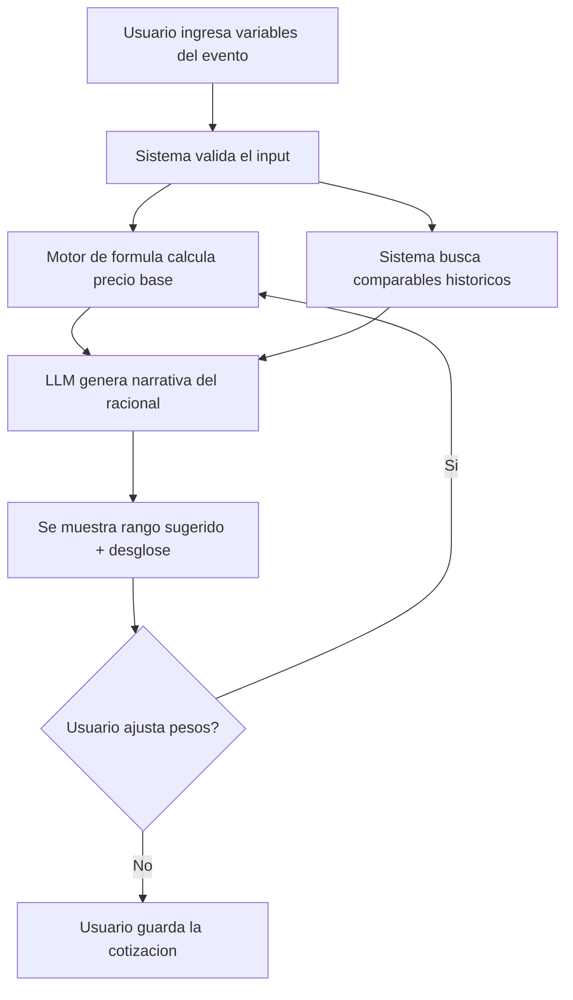
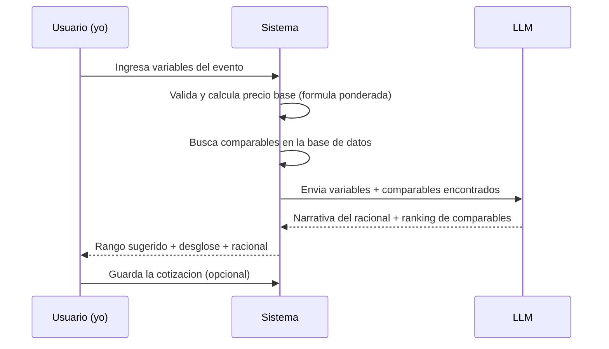

# PACKET — Aforo
### Cotizador de patrocinios para eventos en vivo
Semana 2 · Nicolás Flores

---

## Problema (en mis palabras)

En NODOS y en Cartel, cuando armamos una propuesta de patrocinio, no hay una forma estructurada de decidir cuánto cobrar. El precio sale de "lo que se sintió bien" o de copiar el número del último deal parecido, sin ver todas las variables del evento juntas — aforo, duración, calibre del line-up, exclusividad de categoría, tipo de activación, ciudad. Eso hace que el precio varíe según quién arma la propuesta, no según el evento, y que sea difícil defender el número frente a la marca o frente a mi propio equipo.

## Usuario exacto

Ejecutivos comerciales de agencias de marketing experiencial y producción de eventos en México (mi propio caso en NODOS/Cartel), armando una propuesta de patrocinio para un evento en vivo — festival, concierto, activación deportiva — y necesitando un rango de precio defendible antes de la llamada con la marca.

## Definición de éxito

**Antes de que cierre el módulo:** dado un set de variables de un evento real (aforo, duración, line-up, exclusividad, tipo de activación, ciudad), la plataforma regresa un rango de precio sugerido (mín–objetivo–máx) con el desglose de cuánto pesa cada variable. Puedo correr al menos 3 patrocinios que ya cerré — Ultra/Sprite, Goleiro/Michelob Ultra, Match Cup — y el rango que arroja queda razonablemente cerca del número real que negocié.

## Mockup (imagen generada)

## El flujo (Mermaid — flowchart)

## Quién hace qué (Mermaid — swimlane, 3 actores)

## El benchmark

**El mejor existente en el mundo para esto es:** la metodología "Valuation Next" de IEG (consultoría de patrocinios, referencia de la industria desde 1983) y plataformas SaaS como Valiyou, que ofrecen una calculadora de valuación transparente ("glass box"), recomendaciones de precio con IA, y constructor de paquetes. Herramientas como GumGum/Relo Metrics resuelven un problema distinto: miden exposición en TV y redes vía visión computacional para patrocinios deportivos masivos ya cerrados — no ayudan a cotizar antes de la venta.

**El mío difiere/localiza por:** está calibrado con comparables reales del mercado mexicano de música en vivo y festivales que yo mismo he cerrado (Ultra, Goleiro, Sprite, Match Cup), no con datos de ligas deportivas de EU o Europa; es gratis y rápido para el uso diario de un solo ejecutivo armando una propuesta, no un SaaS empresarial con CRM/contratos/firma electrónica; y resuelve el momento "¿cuánto cobro antes de la llamada?", no la medición de ROI post-evento.

## El long-view (3 años)

Si esta rebanada funciona, en 3 años Aforo es la capa de pricing que uso — y con la que entreno a ejecutivos junior en NODOS/Cartel — antes de cualquier propuesta comercial: una base de comparables mexicanos que crece con cada deal cerrado, pesos que se recalibran solos comparando cada cierre real contra el rango que se sugirió, y un constructor de paquetes (Presenting/Oficial/Proveedor) que convierte el número en una propuesta lista para enviar. Si funciona más allá de mí, es la herramienta que cualquier agencia de eventos en México usa para no improvisar un precio en la sala de juntas.

## Scope cut — qué NO construyo esta semana

- Constructor de paquetes/tiers (Presenting / Oficial / Proveedor) con deliverables sugeridos
- Exportar a PDF / one-pager listo para enviar al cliente
- CRM, gestión de contactos, contratos con firma electrónica
- Multi-usuario o colaboración en equipo (por ahora soy el único usuario)
- Medición de exposición post-evento (es un producto distinto — ese es el problema que resuelve GumGum, no este)

## Arquitectura + stack

| Capa | Elección | Por qué |
|---|---|---|
| Frontend | Next.js (React) en Vercel | Free tier, deploy en minutos, stack recomendado del curso |
| Base de datos | Supabase (Postgres) | Tablas `eventos`, `comparables`, `cotizaciones`; Row Level Security ON |
| Auth | Supabase Auth — "Sign in with Google" | Piso de seguridad: nada de datos guardados sin login |
| LLM | Claude (Anthropic API) | Genera la narrativa del racional y rankea los comparables más cercanos |
| Cálculo base | Fórmula ponderada, corre en el backend (no en el LLM) | El precio base debe ser determinista y auditable; el LLM explica y matiza, no decide el número |
| Hosting | Vercel | Gratis, cumple fácil el mínimo de 2 deploys |

## Plan de prueba

**Pase mecánico:** cargo los 3 patrocinios reales que ya cerré (Ultra/Sprite ≈ $1.2M, Goleiro/Michelob Ultra ≈ $650K, Match Cup ≈ $300K) como inputs, comparo el rango que arroja la fórmula contra el número real negociado, encuentro al menos 1 bug o desajuste de pesos, lo corrijo, redeploy.

**Persona test (Layer 1):** persona "Mauricio" — ejecutivo junior de NODOS armando su primera propuesta solo, sin que yo le explique nada — intentando cotizar un evento ficticio desde cero. Log de cada punto donde se atora o no entiende un campo; corrijo el peor antes del deadline.
